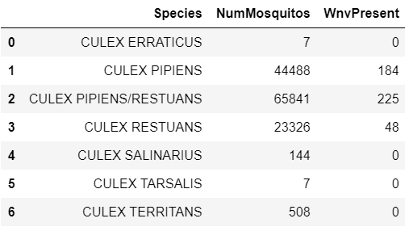

#  Kaggle Competition - Starter
## Contents:
- [Introduction and Problem Statment](#Introduction-and-Problem-Statement)
- [Datasets](#Datasets)
- [Data Dictionary](#Data-Dictionary)
- [External Research](#External-Research)
- [Executive Summary](#Executive-Summary)
- [Data Cleaning](#Data-Cleaning)
- [Exploratory Data Analysis](#Exploratory-Data-Analysis)
- [Cost Benefit Analysis](#Cost-Benefit-Analysis)
- [Feature Engineering](#Feature-Engineering)
- [Conclusion](#Conclusion)
- [Recommendation](#Recommendation)
- [Citation](#Citation)

---

## Introduction and Problem Statement

West Nile virus (WNV) is the leading cause of mosquito-borne disease in the continental United States. 1 Every week from late spring through the fall, mosquitos in traps across the city are tested for the virus. The results of these tests influence when and where the city will spray airborne pesticides to control adult mosquito populations.2

 Although pesticides are known to be effective in dealing with the virus-carrying mosquitoes, it is expensive to deploy pesticides throughout the city of Chicago. As data scientists, we want to understand the factors driving the spread of WNV by leveraging on data collected by Chicago's weather stations. We also want to develop a classification model that could predict the presence of WNV within the area of Windy City. Through these studies, we hope to suggest a cost-efficient and effective method of deploying pesticides within the area.

---

## Datasets

These are the datasets used for this project:
* [`train.csv`](./assets/train.csv): Dataset provided by Kaggle consisting of information related to mosquitos traps such as date, trap id, addresses, map coordinates, number of mosquitos captured and Presence of West Nile Virus.
* [`test.csv`](./assets/test.csv): Dataset provided by Kaggle to be predicted and submitted to Kaggle.
* [`weather.csv`](./assets/weather.csv):Dataset provided by Kaggle from NOAA of the weather conditions of 2007 to 2014, during the months of the tests.
* [`spray.csv`](./assets/spray.csv): Dataset provided by Kaggle from GIC for their spray efforts in 2011 and 2013.
* [`train_linear.csv`](./assets/train_linear.csv): Dataset that was cleaned and feature engineered to be fitted into the model.
* [`test_linear.csv`](./assets/train_linear.csv): Dataset that was cleaned and feature engineered to bepredicted and submitted to Kaggle.
---

## Data Dictionary

| Column      | Dataset          | Dtypes  | Data Description                                                                                                                                      |
|-------------|------------------|---------|-------------------------------------------------------------------------------------------------------------------------------------------------------|
| Latitude   |train_linear.csv/test_linear.csv | float64 | Latitude coordinate of trap from Geocoder                                                                                                             |
| Longitude  |train_linear.csv/test_linear.csv | float64 | Longitude coordinate of trap from Geocoder                                                                                                            |
| wnv_species|train_linear.csv/test_linear.csv | float64 | Species of wnv carrying mosquitoes being mapped with ['CULEX PIPIENS/RESTUANS': 3, 'CULEX PIPIENS': 2, 'CULEX RESTUANS': 1 and 0 for everything else] |
| WnvPresent |train_linear.csv/test_linear.csv | int64   | Presence of West Nile Virus: 1 - present and 0 - not present                                                                                          |
| month      |train_linear.csv/test_linear.csv | int64   | The month that the trap was collected                                                                                                                 |
| year       |train_linear.csv/test_linear.csv | int64   | The year that the trap was collected                                                                                                                  |
| week       |train_linear.csv/test_linear.csv | UInt32  | The week that the trap was collected                                                                                                                  |
| Tmax       |train_linear.csv/test_linear.csv | float64 | Average maximum temperature of the day between 2 stations                                                                                             |
| Tmin       |train_linear.csv/test_linear.csv | float64 | Average minimum temperature of the day between 2 stations                                                                                             |
| Tavg       |train_linear.csv/test_linear.csv | float64 | Average temperature of the day between between 2 stations                                                                                             |
| DewPoint   |train_linear.csv/test_linear.csv | float64 | Average dew point temperature between 2 stations                                                                                                      |
| WetBulb    |train_linear.csv/test_linear.csv | float64 | Average wet bulb temperature between 2 stations                                                                                                       |
| Heat       |train_linear.csv/test_linear.csv | float64 | Average temperature difference between 2 stations from base 65 degree Fahrenheit (Season begins with July)                                            |
| Cool       |train_linear.csv/test_linear.csv | float64 | Average temperature difference between 2 stations from base 65 degree Fahrenheit (Season begins with January)                                         |
| PrecipTotal|train_linear.csv/test_linear.csv | float64 | Average total precipitation between 2 stations                                                                                                        |
| StnPressure|train_linear.csv/test_linear.csv | float64 | Average station pressure between 2 stations                                                                                                           |
| SeaLevel   |train_linear.csv/test_linear.csv | float64 | Average sea level between 2 stations                                                                                                                  |
| ResultSpeed|train_linear.csv/test_linear.csv | float64 | Average resultant wind speed between 2 stations                                                                                                       |
| ResultDir  |train_linear.csv/test_linear.csv | float64 | Average resultant direction(degrees) between 2 stations                                                                                               |
| AvgSpeed   |train_linear.csv/test_linear.csv | float64 | Average wind speed between 2 stations                                                                                                                 |
| Sunrise    |train_linear.csv/test_linear.csv | int64   | Sunrise timing represented by seconds of the day                                                                                                      |
| Sunset     |train_linear.csv/test_linear.csv | int64   | Sunset timing represented in seconds of the day                                                                                                       |
| SnowFall   |train_linear.csv/test_linear.csv | float64 | Snowfall amount                                                                                                                                       |

## External Research

West Nile (WN) virus is a mosquito-borne flavivirus and human, equine, and avian neuropathogen. Birds are the natural reservoir (amplifying) hosts, and WN virus is maintained in nature in a mosquito-bird-mosquito transmission cycle primarily involving Culex sp mosquitoes.3

---

## Executive Summary
This research goal was to understand the factors driving the spread of West Nile Virus by leveraging on data collected by Chicago's weather stations. Factors that were identified were Sunset, Sunrise, Preciptotal, Temperage Average and WetBulb.
As this is a Kaggle competition, the classification model that performed the best in terms of AUC score was XGBoost, giving a score of 0.86. However, in the context of selecting a model that would benefit the city of Chicago the most, the model selected was Random Forest, which was optimised for false negative.
A cost-and-benefit analysis had also been conducted using a research conducted in Sacramento as a proxy. Due to insufficient data, we found the efficacy of spraying pesticide to be inconclusive, nonetheless the team recommend spraying to be done in start of summer and in areas with the highest occurrence of WNV.

---

## Data Cleaning

##### Train/Test dataset

- Dropped duplicated rows for traps that had captured less than 50 mosquitos.
- Summed number of mosquito for traps with count above 50 and WnvPresent using groupby.
- Mapped the values of WnvPresent with anything above 0 as 1, as it would indicate Wnv presence.
- Discovered 2 traps (T009, T035) had 2 locations tagged to them as they were relocated after 2007 and reassign a suffix (_A & _B) to identify them.

##### Spray dataset

- Dropped duplicated rows as it is likely to be due to human error during data entry.

##### Weather

- Identifying missing data and created a function to return as 'np.nan'.
- Converting columns that should be numeric into numeric values
- Dropping the column 'water1' as there is zero data input.
- Identified error in sunset timing such as 1660,1760 & 1860 and amended them to 1700,1800,1900 respectively.

---

## Exploratory Data Analysis

### Timeline of dataset

|Dataset|Timeline|
|---|---|
train|2007-05-29 to 2013-09-26
test|2008-06-11 to 2014-10-02
weather|2007-05-01 to 2014-10-31
spray|2011-08-29 to 2013-09-05

Spray data timeline only coincides within a subset of the dates that the test and train data covers. This suggest that we would most likely have to omit spray data as modelling features moving forward.

 However this data set would be used for cost benefit analysis instead.

### Mosquito Species

Although there are 6 different types of species, 3 of the species made up ~96% of the species collected and are identified as carriers of WNV.
 They are:
- CULEX PIPIENS/RESTUANS
- CULEX RESTUANS
- CULEX PIPIENS  

### Calendar Map for mosquito count in respective Years

In 2007, August seem to have days with high count of mosquitos approximately 5000-6000. 
However, the number of mosquitos seems to have dropped over the years comparing the number of colored grids.

Additionally, we would like to find which month tend to have the highest increase in WnvPresent.

We can see from the above graph that in the month of July in each year, steep increase of WnvPresent occurs, which therefore prompt us to explore what specific or combination of weather charateristic occurs during this month.

Next, we will look at Dewpoint and Tavg (average temperature) relative to the week of the year, this for added granularity in our analysis.

From the above WnvPresent graph, we can observe that occurences of WNV peaks around week 33-34 (around August). In Chicago, August during the summer time and therefore is very warm. Temperature usually peaks around July (above we have a plot of mean temperature by WeekofYear).

As we can see from the temperature curve, the weather starts getting warm after week 23 and peaks berween week 28 to 35, before gradually cooling off. Dewpoint also follows this pattern of increasing after week 23 before decreasing after week 35.

Additionally, we can observe that during the period of week 25 to 35, mean Dewpoint is above 50, therefore suggesting high amount of moisture in the air.

This coincides with our subject background research as well.

Culex mosquitos favor high humidity conditions as they function best in these environments. They usually require around 2 weeks to grow from larvae to an adult, as we see cases slowly rising at week 28. There will be a very steep rise in cases up till the peak around week 33/34. Which coincides with the period of week 25 to 35, where average temperature hovers around the high of 72.5 to 76 degrees.

Just as temperature drops after week 30, and Dewpoint after week 34, the presence of WNV in the traps tend to fall sharply at week 35 onwards.

### Heatmap of WNVPresent in Respective Years

Traps are represented as 'X' in the heatmaps above. 

## Heatmap of Spray Location

Spray was only conducted in one area in a small in 2011, although the prevalence of WNV is not as serious as compared to 2013 where spraying had been done in more areas, likely to impede the spread of the virus further.

This discovery has prompted the team to look at dates of these sprays relative to the count of mosquitos.

Spraying had only been done on two separate dates in 2011, and 10 separate dates in 2013. What we can see that the efficacy of the spray is not very clear. The highlighted areas in the graphs shows the 14 periods after those specific spray dates, where the count of mosquitoes still had increased. Whereas on other spraying dates in 2013, after n number of days, the count of mosquitoes had decreased instead.

A common pattern that emerge from both years, is that a steady decline in mosquito count occurs towards the end of summer, where we learnt that when average temperate and dewpoint decrease, the environment in Chicago would be less favourable for mosquito activity. In addition, given that we only have 10 unique spray dates, there is insufficient data to meaningfully understand the effect of spraying on mosquito population.

From a modelling point of view, as mentioned previously when comparing dataset timelines, the incomplete data makes it difficult to properly train our model. This has therefore led the team to believe that the count of mosquitos are more likely determined by weather conditions.

Although how this dataset can be further explored is by conducting a cost benefit analysis, as unlike weather. Spraying efforts something that the municipalities of Chicago can control.

---
## Cost Benefit Analysis

#### Febrille Illness and Serious Symptoms when infected with WNV

According to the Centers of Disease Control and Prevention (CDC) 4, there are two main outcomes that the team believes would result in economic cost.

Febrille illness (WNF):
- About 1 in 5 people who are infected develop a fever along with other symptoms such as headache, body aches.
- Most people with this type of West Nile virus disease recover completely, but feeling of fatigue can last for weeks or months.
    - We will assume that infected people are working adults that would require 2 weeks on average to recover, and would therefore miss work during this period.

West Nile neuroinvasive disease (WNND):
- About 1 in 150 people who are infected develop a severe illness affecting the central nervous system such as encephalitis (inflammation of the brain) or meningitis (inflammation of the membranes that surround the brain and spinal cord).
- This would require the person to stays in a hospital while receiving medical care or treatment or in some cases receive treatments as outpatients.
- We will assume these patients are unable to work for 60 days.

#### Using Sacramento County as an Example

Sacremento was decided as a proxy as comprehensive research had already been done on the cost associated with contracting WNV.

In 2005, an outbreak of WNV disease occurred in Sacramento County, California where 163 human cases were reported. In response, Sacramento-Yolo Mosquito and Vector Control District conducted an emergency aerial spray.

The economic impact of the outbreak had cost the county an approximate 2.28 million dollars in medical treatment and patients’ productivity loss for both West Nile fever and West Nile neuroinvasive disease. Vector control cost an approximate 701,790 dollars , including spray procedures and overtime hours. The total economic impact of WNV was approximately 2.98 million dollars.

From this study's cost-benefit analysis indicated that only 15 cases of West Nile neuroinvasive disease would need to be prevented to make the emergency spray cost-effective.

##### Average Costs in terms of medical and productivity loss

| Type of Cost                                 | WNF Patient | WNND Patient |
|----------------------------------|-------------|--------------|
| Medical                          | \$302        | \$33,143      |
| Productivity Loss (per work day) | \$191        | \$191         |
| Productivity Loss (per non work day)  | \$125        | \$125         |

The numbers above are an approximation of the average cost per patient type in Sacramento as with each patient, the extent of treatment recieved would vary. We will use this as a proxy for the case of Chicago.5

##### Cost to Spray in 2011 in Chicago
Seeing from the image below, the area where spray activity had occured in 2011 was at O'Hare international airport, an area of approximately 23.33 km2. The area which Sacramento had calculated the cost to spray for an area of 477 km2, was 1,438,619 dollars. Therefore, giving us an estimate cost of spray in Chicago of 70,362 dollars for an area of 23.33 km2.

##### Estimating Productivity Loss Cost in 2011 in Chicago

Assuming 150 people had tested positive to WNV in 2011. If 1 in 5 people develop WNF symptoms and 1 in 150 people develop WNND symptoms, 20 people with WNV would result in economic cost of approximately 81,360 dollars ((\\$302 + \\$191\*10 work days + \\$125\*4 non work days) \*30 patients), while 1 person with WNND would result in economic cost of approximately 43,547 dollars (\\$33,143 + \\$191\*44 work days + \\$125\*16 non work days).

This would result in an estimate of 124,907 dollars in total economic cost in 2011.

### Analysis and Recommendation

What we find is that it would have cost the city of Chicago a total of 195,269 dollars in 2011 when spraying had only been done in a single location where the occurence of WNV is not the highest.

One recommendation we would suggest is to have spraying efforts concentrated at the beginning of July or latest August, instead of September.

Assuming budget constraints as the reason why spraying efforts had only been done in one location, it is recommended for spraying efforts to be done in the region we have identified in the image below instead. The area identified is where the highest concentration of WNV had occured as well as the  highest number of mosquito counts. This region covers an area of 5.42 km2. Spraying this area alone would only cost 16,323 dollars, and would have a higher likelihood to prevent the occurrence of WNNF or WNND thus being a more cost effective.

If spraying just this area could hypothetically reduce the number of people infected by 20%, and statistically, 24 people may develop WNF symptoms and 0 people develop WNND symptoms, the total cost to spray and in productivity loss would be 81,410 dollars. This would save the city, 113,859 dollars.

### Conclusion

As the current datasets do not substantially point to a significant impact from spraying, more evidence (from a better designed spraying regime) are needed for a more concrete recommendation. Nonetheless, the recommendations that we can offer is where and when spraying efforts could be done.

Other areas to study would include, the relationship between spray effectiveness and other factors such as wind direction, elevation or landscape. Or study the use of other methods such as larvicide.

---

## Feature Engineering

#### Merging of both stations in weather dataset

Test data does not have a station feature to be used in our prediction.

As Station 1 and Station 2 creates two entry of data for a given date in our cleaned train dataset, the team has decided to create new dataframe which takes the average values of numeric weather data (after imputing missing values), and selecting the categorical columns of the appropriate station that does not have missing data believing that this would represent the weather conditions of the general area.

#### Trap Feature
As we had discovered above the same trap have changed locations across different observations.

Furthermore, the number of unique traps in the test dataset is greater than the train dataset. Since trap numbers are nominal, this means that there would be certain trap numbers in the test dataset that we are unable to assign importance to during the modelling process, which would be inaccurate since these traps are still within the same study area.

Therefore, we decided to drop the trap column from our model.

#### Features that Describe Location

The train dataset has multiple features that describe the location of observation, including address, block, street, addressnumberandstreet and addressaccuracy. However, since we have latitude and longitude, these features are redundant and do not add anything more meaningful to our model.

Thus, we will drop them.

#### Features that Describe Condition Summary of the Weather

The column 'CodeSum' which represents the condition summary of the weather, had more unique values in the test as compared to the train dataset. As this is a categorical feature, it will be more accurate to use the measurements such as (temperature, wind speed etc.) to determine the condition of the weather.

Therefore we decided to drop them.

#### Features that Desribe the Sunrise and Setset Time

We have decided to convert the sunrise/sunset time to seconds as we believed that machines do not process time similarly as us. For instance, we read 1840 as 18 hours and 40 minutes but the machine only reads 1840 as an integer. That being said, we understand that there are a maximum of 24 hours and 60 minutes but not for machine. Therefore, we decided to scale the timing to seconds as there can only be 86400 seconds a day and it is more intuitive for both machine and us.

#### Features that Describe the species of mosquitos

Comparing the mosquito species between both train and test, we found that test dataset had an value ("UNSPECIFIED CULEX").   We decided to map species that carries the West Nile Virus as the following:

- 'CULEX RESTUANS': 1
- 'CULEX PIPIENS': 2
- 'CULEX PIPIENS/RESTUANS': 3
- Everything else: 0

## Conclusion

We tried a variety of models including Logistic Regression, Random Forest, Decision Trees, K-Nearest Neighbors, Support Vector Machine (Classifier) as well as XGBoost. All the models have outperformed the baseline ROC AUC Score of 0.5. In the end, we have decided to hypertune 4 models based their base model ROC AUC Scores. The 4 models are:
- Logistic Regression
- Random Forest
- Support Vector Machine (Classifer)
- XGBoost (Classifier)

Clearly, **XGBoost 2nd hypertuned** is the best model based on the **ROC AUC Score of 0.865**. In addition, as part of our problem statement, besides using ROC AUC Score for measuring the model prediction, we have to look at the **FN (Type II error) and FP (Type I Error)**.

Though both XGBoost and Random Forest have similar ROC AUC Score (~86%), the False Positive (FP/Type I Error) of Random Forest is significantly higher as compared to XGBoost, this might have more potential cost incurred where we could have over-sprayed the pesticides when WNV is absent.

Below is a further breakdown on why FN and FP are important. Based on the 2 models:

`Assumption`: Based on model prediction, we assume that, when **WNV is predicted as present, we will spray pesticide**.

- `Type I Error (FP)`: Predicted WNV present, but actually there is no WNV present.
    - When FP is high, we might "overspray" the pesticides, which would have higher cost incurred.
    - Cost for spray operations. (estimated cost ~3,000/km2)
    - One way to look at FP is by looking at the Specificity (tn(tn + fp)) of the model where having a high Specificity, will mean that FP is rather low.

- `Type II Error (FN)`: Predicted WNV absent, but actually there is WNV present.
    - When FN is high, we might have compromised the safety of the people in Chicago as there is WNV present.
    - Cost incurred by the people, their family, the government, etc. (estimated cost ~2,700/case)
    - One way to look at FN is by looking at the Sensitivity (tp(tp + fn)) of the model where having a high Sensitivity, will mean that FN is rather low.

Hence, keeping a balance between FP and FN is also an important factor in the social aspect. Based on our best model, below is our confusion matrix and ROC AUC.

### Top 20 Features
Based on our best model, features that are related to weather and time are important factors in predicting the model.

## Recommendation

Although "prevention is better than cure" in most cases, a cost benefit analysis would help in reducing some of the potential cost incurred from "over-spraying" and "under-spraying".

One recommendation we would suggest is to have spraying efforts could be concentrated at the beginning of July or latest August, instead of September. Assuming budget constraints as the reason why spraying efforts had only been done in one location, what we would also recommend to make the spraying process more cost effective, is by having spraying efforts to be done in the region we have identified in the image below instead. The area identified is where the highest concentration of WNV had occurred as well as the highest number of mosquito counts.

**Example: Case of 2011**

There is a region that covers an area of 5.42 km2. Spraying this area alone would only cost 16,323 dollars, and would have a higher likelihood to prevent the occurrence of WNNF or WNND.
If spraying just this area could hypothetically reduce the number of people infected by 20%, and statistically, 24 people may develop WNF symptoms and 0 people develop WNND symptoms, the total cost to spray and in productivity loss would be 81,410 dollars. This would save the city, 113,859 dollars.

However, as the current datasets do not substantially point to a significant impact from spraying, more evidence (from a better designed spraying regime) are needed for a more concrete recommendation. For example, spraying efforts could be more concentrated at the start of August so that there would be enough time to observe if mosquito numbers decline, in the relative absence of other confounding factors (such as temperature).

Nonetheless, the recommendations that we can offer is where and when spraying efforts could be done.
Other areas to study would include, the relationship between spray effectiveness and other factors such as wind direction, elevation or landscape. Or study the use of other methods such as larvicide.

---

## Citation

1[Centers for Disease Control and Prevention(CDC), (June 3, 2020) West Nile Virus](https://www.cdc.gov/westnile/index.html)
 
2[Robert Wood Johnson Foundation., (April 23, 2015) Kaggle - West Nile Virus Prediction](https://www.kaggle.com/c/predict-west-nile-virus)
 
3[Campbell, G. L., Marfin, A. A., Lanciotti, R. S., & Gubler, D. J. (2002). West nile virus. The Lancet infectious diseases, 2(9), 519-529.](https://www.sciencedirect.com/science/article/abs/pii/S1473309902003687)
 
4[Cdc.gov. 2021. Symptoms, Diagnosis, & Treatment | West Nile Virus | CDC.](https://www.cdc.gov/westnile/symptoms/index.html).
 
5[Barber, L., Schleier, J., &amp; Peterson, R. (2010, March). Economic cost analysis of West Nile virus outbreak, Sacramento County, California, USA, 2005. Retrieved May 06, 2021](https://www.ncbi.nlm.nih.gov/pmc/articles/PMC3322011/#:~:text=The%20total%20economic%20impact%20of%20the%202005%20WNV%20disease%20outbreak,the%20emergency%20spray%20is%20uncertain.)
